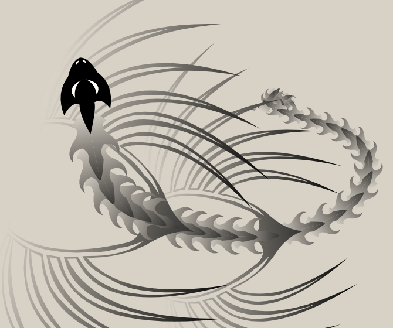
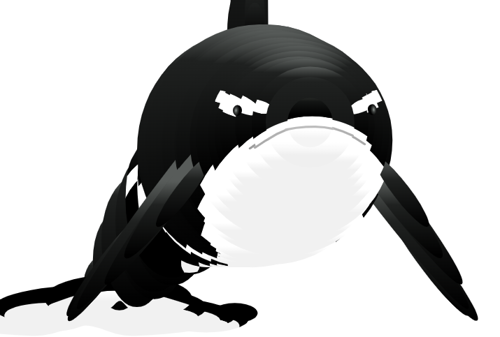

# weird-monster
Weird Monster - html, css and js
# Demo
* One: <a href="https://tuberboy.github.io/weird-monster/one.html" target="_blank">Click Here</a>
* Two: <a href="https://tuberboy.github.io/weird-monster/two.html" target="_blank">Click Here</a>
* Three: <a href="https://tuberboy.github.io/weird-monster/three.html" target="_blank">Click Here</a>
* Four: <a href="https://tuberboy.github.io/weird-monster/four.html" target="_blank">Click Here</a>
* Five: <a href="https://tuberboy.github.io/weird-monster/five.html" target="_blank">Click Here</a>

# Spider

* Demo: <a href="https://tuberboy.github.io/weird-monster/spider.html" target="_blank">Click Here</a>

# Hourse

* Demo: <a href="https://tuberboy.github.io/weird-monster/hourse.html" target="_blank">Click Here</a>

# Dragon

* Demo: <a href="https://tuberboy.github.io/weird-monster/dragon.html" target="_blank">Click Here</a>

# Curly Cursor

* Demo: <a href="https://tuberboy.github.io/weird-monster/curlycursor.html" target="_blank">Click Here</a>

# Neon Curly Cursor

* Demo: <a href="https://tuberboy.github.io/weird-monster/neoncurlycursor.html" target="_blank">Click Here</a>

# Canvas Text

* Demo: <a href="https://tuberboy.github.io/weird-monster/canvastext.html" target="_blank">Click Here</a>

# Attraction

* Demo: <a href="https://tuberboy.github.io/weird-monster/attraction.html" target="_blank">Click Here</a>

# Blue (Triangles) dragon

* Demo: <a href="https://tuberboy.github.io/weird-monster/bluetringlesdragon.html" target="_blank">Click Here</a>

# Monster Electrico

* Demo: <a href="https://tuberboy.github.io/weird-monster/monsterelectrico.html" target="_blank">Click Here</a>

# Shark Monster

* Demo: <a href="https://tuberboy.github.io/weird-monster/shark" target="_blank">Click Here</a>

# Octopus

* Demo: <a href="https://tuberboy.github.io/weird-monster/octopus.html" target="_blank">Click Here</a>

# WebGL Ghost

* Demo: <a href="https://tuberboy.github.io/weird-monster/ghost.html" target="_blank">Click Here</a>

# Lightning Visualization

* Demo: <a href="https://tuberboy.github.io/weird-monster/lightning.html" target="_blank">Click Here</a>

# Others

* ChainFlow Demo: <a href="https://tuberboy.github.io/weird-monster/interactiveam.html" target="_blank">Click Here</a>

* Tree Demo: <a href="https://tuberboy.github.io/weird-monster/treeam.html" target="_blank">Click Here</a>

* Fireworks Demo: <a href="https://tuberboy.github.io/weird-monster/attractivefw.html" target="_blank">Click Here</a>

# Games

* Mario Demo: <a href="https://tuberboy.github.io/weird-monster/mario" target="_blank">Click Here</a>
